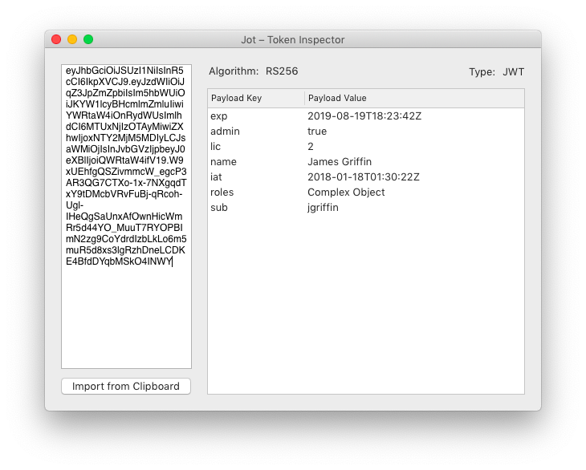

# Jot
## A utility application for Decoding and Verifying JWT tokens.

JWT tokens are a common format for Tokens used by REST APIs. From [Auth0](https://jwt.io/introduction/)

> JSON Web Token (JWT) is an open standard (RFC 7519) that defines a compact and self-contained way for securely transmitting information between parties as a JSON object.

This application decodes the token and displays the contents of the JWT Payload. Useful for veryifying the contents of your token are correct and quickly checking when the token expires or was issued.

